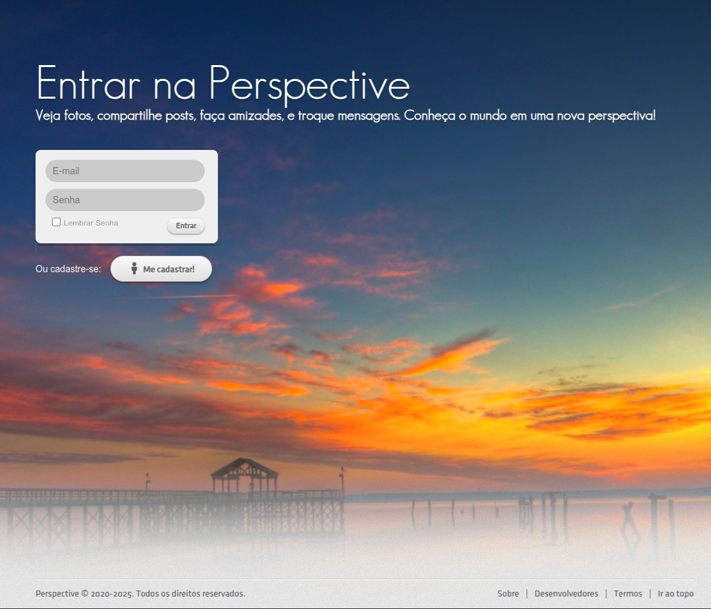
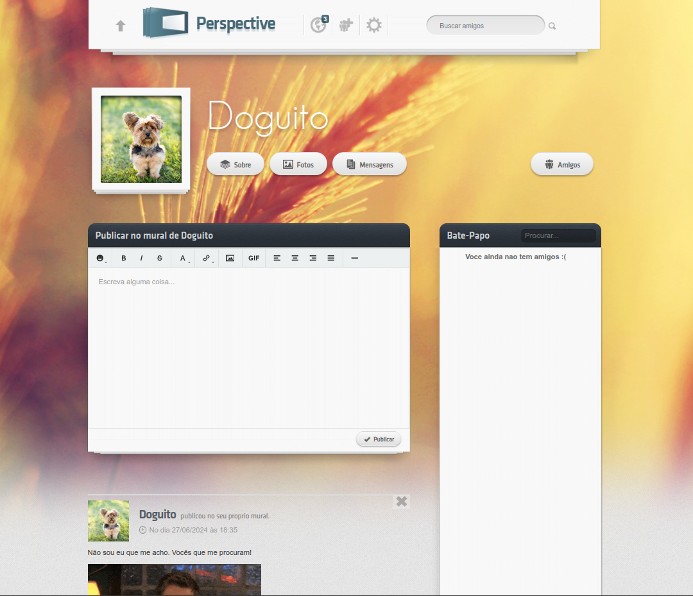

# Perspective Social Network

Perspective is a simple open-source Social Network built with PHP that allows users to connect, share content, and interact in a familiar social media environment.

This version contains usability issues that were purposely introduced for research purposes. 

Login             |  Timeline
:-------------------------:|:-------------------------:
  |  

## Features

- **User Profiles**: Customizable user profiles with personal information, profile pictures, and cover photos
- **Timeline**: View and interact with content from your network in a chronological feed
- **Friend System**: Connect with other users through friend requests
- **Messaging**: Private messaging system between connected users
- **Photo Sharing**: Upload and share photos with your network
- **Comments & Reactions**: Interact with posts through comments and likes
- **Search**: Find other users and content easily


## System Requirements

- PHP 7.2 or higher
- MySQL 5.7 or MariaDB 10.x
- Apache or Nginx web server
- mod_rewrite enabled (for Apache)


## Installation

1. **Clone the repository**
   ```
   git clone https://github.com/yourusername/perspective.git
   cd perspective
   ```

2. **Database setup**
    - Create a new MySQL database
    - Import the `perspective.sql` file to set up the database schema and sample data
   ```
   mysql -u username -p your_database_name < perspective.sql
   ```

3. **Configuration**
    - Edit the database connection settings in `app/models/model.php` to match your environment:
   ```php
   // Update these values with your database credentials
   $this->host = "localhost";
   $this->user = "your_username";
   $this->pass = "your_password";
   $this->dba = "your_database";
   ```

4. **Web server configuration**

   **For Apache**:
   Create or edit the `.htaccess` file in the root directory:
   ```
   RewriteEngine On
   RewriteCond %{REQUEST_FILENAME} !-f
   RewriteCond %{REQUEST_FILENAME} !-d
   RewriteRule ^(.*)$ index.php/$1 [L]
   ```

   **For Nginx**:
   Add the following to your server block:
   ```
   location / {
       try_files $uri $uri/ /index.php?$query_string;
   }
   ```

5. **File permissions**
    - Ensure the web server has write permissions to the following directories:
   ```
   chmod -R 775 _assets/uploads/
   ```

6. **Access the application**
    - Navigate to the URL where you installed the application
    - The default login credentials for the sample accounts are in the SQL dump

## Directory Structure

```
.
├── _assets                # Static assets (CSS, JS, images)
├── app
│   ├── controllers        # Application controllers
│   ├── models             # Data models
│   └── views              # View templates
├── index.php              # Application entry point
└── system                 # Core system components
    ├── helpers            # Helper classes
    └── system.php         # Main system class
```

## MVC Architecture

Perspective follows the Model-View-Controller (MVC) design pattern:

- **Models** (`app/models/`): Handle data logic and database operations
- **Views** (`app/views/`): Display the user interface and present data
- **Controllers** (`app/controllers/`): Process user requests and coordinate between models and views

## Key Components

### Controllers

- `indexController.php`: Handles the main page and timeline
- `loginController.php`: Manages user authentication
- `profileController.php`: Displays and updates user profiles
- `messagesController.php`: Handles private messaging
- `friendsController.php`: Manages friend connections
- `photosController.php`: Handles photo uploads and galleries

### Models

- `basicModel.php`: Core database functionality
- `loginModel.php`: User authentication methods
- `profileModel.php`: User profile data operations
- `messagesModel.php`: Message storage and retrieval
- `friendsModel.php`: Friend relationship management

### Helpers

- `authHelper.php`: Authentication utilities
- `uploadHelper.php`: File upload handling
- `hashHelper.php`: Password hashing and verification
- `sessionHelper.php`: User session management

## Security Features

- Password hashing with salting
- Session management and validation
- CSRF protection
- Input sanitization

## Sample User Accounts

The database dump includes several sample user accounts to demonstrate the functionality:

- **Username**: admin@gmail.com
  **Password**: acrebiano

## License

See the [LICENSE](LICENSE) file for licensing information.

## Citation

If you use this project for your research or academic work, please cite it as:

```bibtex
@inproceedings{de2022framework,
  title={A Framework to Semi-automated Usability Evaluations Processing Considering Users’ Emotional Aspects},
  author={de Souza Santos, Fl{\'a}via and Vin{\'\i}cius Treviso, Marcos and Gama, Sandra Pereira and de Mattos Fortes, Renata Pontin},
  booktitle={International Conference on Human-Computer Interaction},
  pages={419--438},
  year={2022},
  organization={Springer}
}
```
